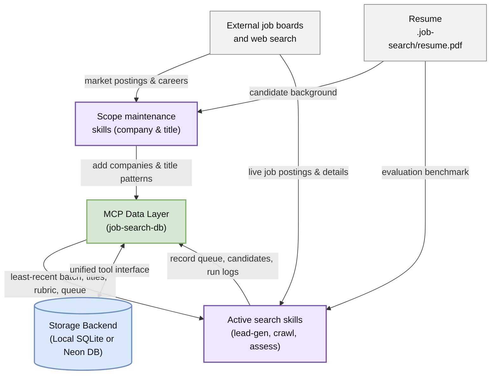
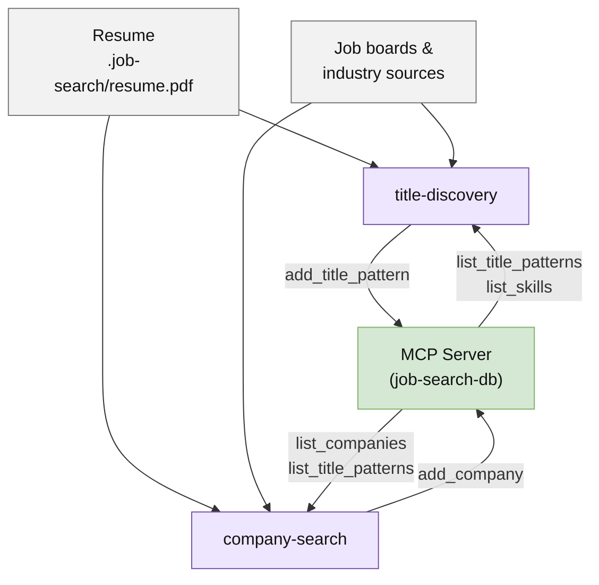
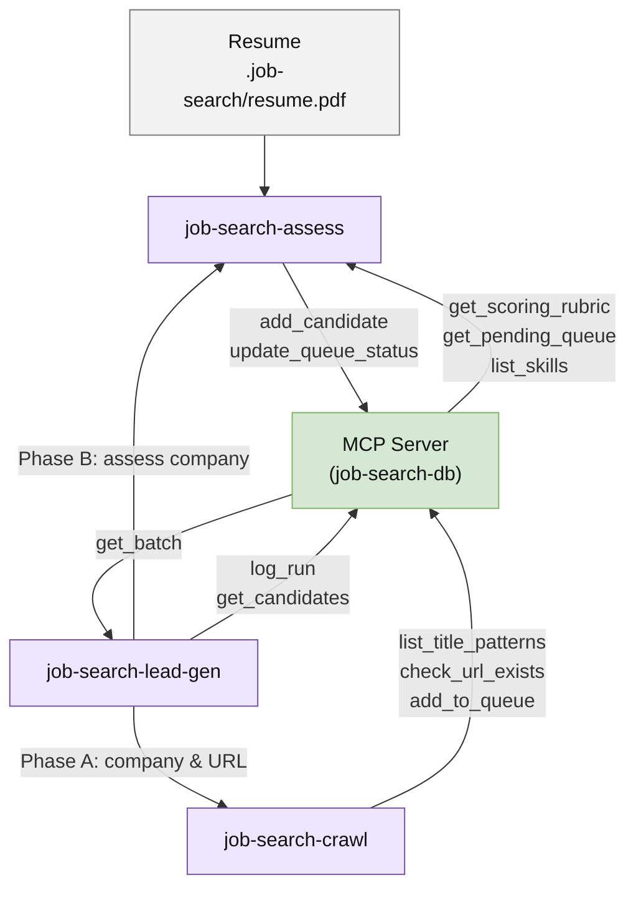
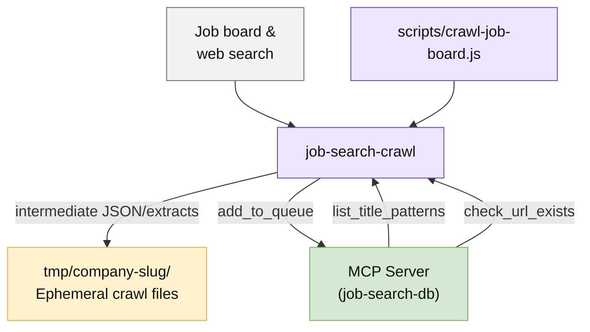
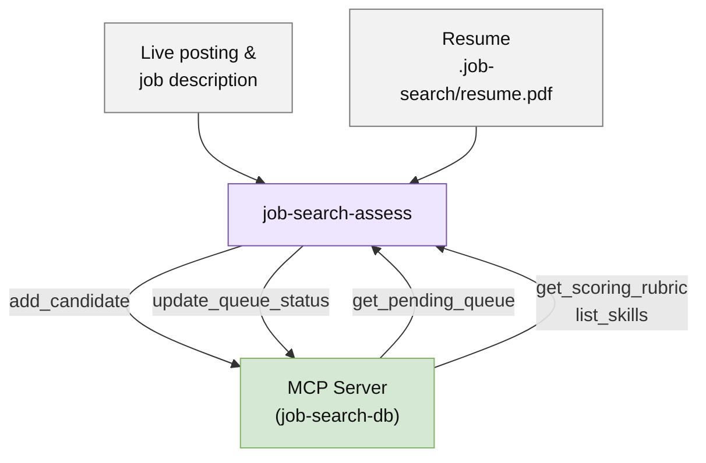
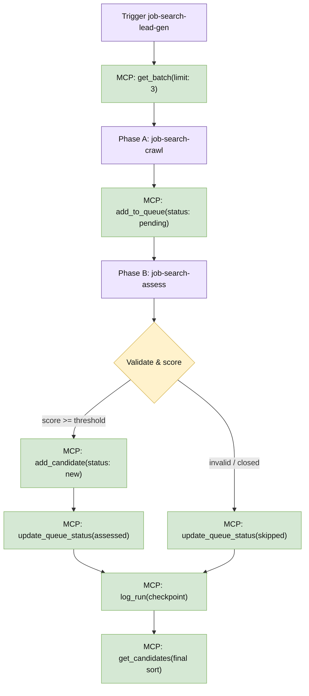
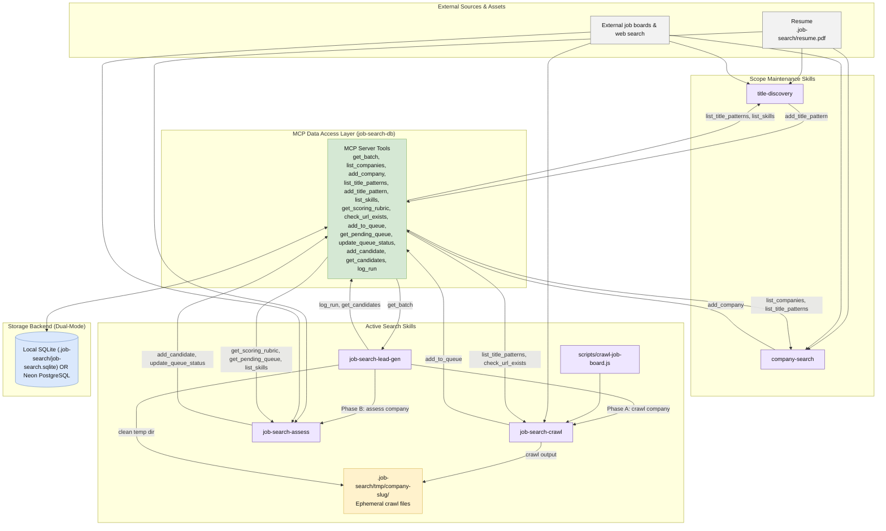

# Job Search Pipeline Overview

> The overview is split into progressive levels of detail. Start with the system at a glance, use the focused views to trace individual components and tools, and consult the full dependency map only when needed.

## 1. System at a glance

This view shows the primary conceptual groups and runtime interactions through the MCP data access layer.

---

## 2. Scope maintenance view

These skills expand the target companies and title patterns via MCP tools before active search runs.

---

## 3. Active search view

The orchestrator completes crawl and assessment sequentially per company, interacting strictly through MCP tools.

---

## 4. Crawl and assessment detail

### 4a. Crawl detail

### 4b. Assessment detail

---

## 5. State and checkpoint lifecycle

The MCP data access layer abstracts queue state, candidate records, and run checkpoints.

---

## 6. Full dependency view

